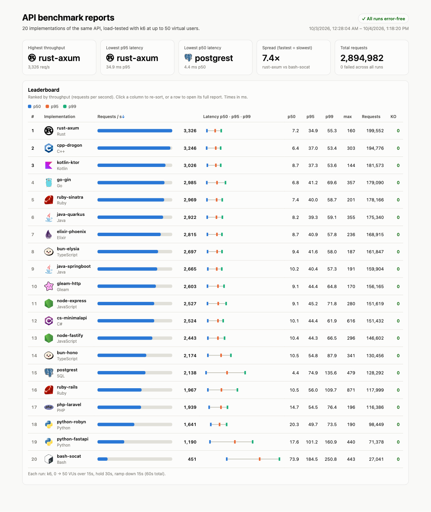

# ApiBattle

Simple API for banking API that allows managing accounts and transactions. It works as a ledger for tracking all financial activities, so transactions can only be added and not modified or deleted. And an account balance is always derived from the transactions.

## Features

- Get account details including current balance
- Get account transaction history
  - List transactions paginated sorted by latest first
- Get transaction details by ID
- Add new transactions

## Infra

- PostgreSQL
- Docker
- Nginx

## Testing

- K6 for load testing

## Running

```sh
docker compose up -d --build   # Postgres + 2 API replicas behind Nginx on :9999
# pick an implementation with API_IMPL (default: api-ruby-sinatra)
API_IMPL=api-rust-axum docker compose up -d --build
docker run --rm -i --network apibattle_default -e BASE_URL=http://nginx \
  -v "$PWD/k6:/scripts" grafana/k6 run /scripts/load-test.js
```

## Results

20 implementations, each load-tested with k6 (0 → 50 VUs over 15s, hold 30s, ramp down 15s). Every run finished with 0 failed requests and passed the `p(95)<200ms` threshold. bash-socat came closest, with a p95 of 184 ms. Open [reports/index.html](reports/index.html) for the sortable leaderboard. Each row links to that run's full report.



| # | Implementation | Req/s | p50 (ms) | p95 (ms) | p99 (ms) | Requests |
|--:|---|--:|--:|--:|--:|--:|
| 1 | [rust-axum](reports/rust-axum-report.html) | 3,326 | 7.2 | 34.9 | 55.3 | 199,552 |
| 2 | [cpp-drogon](reports/cpp-drogon-report.html) | 3,246 | 6.4 | 37.0 | 53.4 | 194,776 |
| 3 | [kotlin-ktor](reports/kotlin-ktor-report.html) | 3,026 | 8.7 | 37.3 | 53.6 | 181,573 |
| 4 | [go-gin](reports/go-gin-report.html) | 2,985 | 6.8 | 41.2 | 69.6 | 179,090 |
| 5 | [ruby-sinatra](reports/ruby-sinatra-report.html) | 2,969 | 7.4 | 40.0 | 58.7 | 178,166 |
| 6 | [java-quarkus](reports/java-quarkus-report.html) | 2,922 | 8.2 | 39.3 | 59.1 | 175,340 |
| 7 | [elixir-phoenix](reports/elixir-phoenix-report.html) | 2,815 | 8.7 | 40.9 | 57.8 | 168,915 |
| 8 | [bun-elysia](reports/bun-elysia-report.html) | 2,697 | 9.4 | 41.6 | 58.0 | 161,847 |
| 9 | [java-springboot](reports/java-springboot-report.html) | 2,665 | 10.2 | 40.4 | 57.3 | 159,904 |
| 10 | [gleam-http](reports/gleam-http-report.html) | 2,603 | 9.1 | 44.4 | 64.8 | 156,165 |
| 11 | [node-express](reports/node-express-report.html) | 2,527 | 9.1 | 45.2 | 71.8 | 151,619 |
| 12 | [cs-minimalapi](reports/cs-minimalapi-report.html) | 2,524 | 10.1 | 44.4 | 61.9 | 151,432 |
| 13 | [node-fastify](reports/node-fastify-report.html) | 2,443 | 10.4 | 44.3 | 66.5 | 146,602 |
| 14 | [bun-hono](reports/bun-hono-report.html) | 2,174 | 10.5 | 54.8 | 87.9 | 130,456 |
| 15 | [postgrest](reports/postgrest-report.html) | 2,138 | 4.4 | 74.9 | 135.6 | 128,292 |
| 16 | [ruby-rails](reports/ruby-rails-report.html) | 1,967 | 10.5 | 56.0 | 109.7 | 117,999 |
| 17 | [php-laravel](reports/php-laravel-report.html) | 1,939 | 14.7 | 54.5 | 76.4 | 116,386 |
| 18 | [python-robyn](reports/python-robyn-report.html) | 1,641 | 20.3 | 49.7 | 73.5 | 98,449 |
| 19 | [python-fastapi](reports/python-fastapi-report.html) | 1,190 | 17.6 | 101.2 | 160.9 | 71,378 |
| 20 | [bash-socat](reports/bash-socat-report.html) | 451 | 73.9 | 184.5 | 250.8 | 27,041 |

Highlights:

- **Fastest:** rust-axum has the highest throughput (3,326 req/s) and the lowest p95 (34.9 ms). cpp-drogon is within 3%.
- **Lowest median:** postgrest has a p50 of 4.4 ms, but it has the widest tail of the top 15 (p99 135.6 ms).
- **Spread:** 7.4× between the fastest and the slowest. The 17 fastest are within 1.7× of each other, which suggests the shared Postgres limits throughput more than the language does.
- **Same language, different framework:** ruby-sinatra (2,969 req/s) is about 1.5× faster than ruby-rails. bun-elysia beats bun-hono, java-quarkus beats java-springboot, and python-robyn beats python-fastapi.

Numbers come from runs on a single machine (APIs, Postgres, Nginx and k6 all in Docker on one host). Compare them with each other, not as absolute figures.

### Generating a report

```sh
docker run --rm -i --network apibattle_default -e BASE_URL=http://nginx \
  -v "$PWD/k6:/scripts" grafana/k6 run \
  --summary-export /scripts/summary.json --out csv=/scripts/raw.csv.gz /scripts/load-test.js
python3 k6/report.py k6/summary.json k6/raw.csv.gz reports/<impl>-report.html "<impl>"
```

## API

Accounts `1000` and `2000` are seeded by [db/init.sql](db/init.sql). Amounts are integers in minor units (e.g. cents). Balance = credits − debits; debits that would overdraw the account are rejected with `422`.

| Method | Path | Description |
|---|---|---|
| `GET` | `/accounts?page=1&page_size=20` | List accounts with balances, ordered by ID (`page_size` ≤ 100) |
| `GET` | `/accounts/{id}` | Account details with current balance |
| `GET` | `/accounts/{id}/transactions?page=1&page_size=20` | Transaction history, latest first (`page_size` ≤ 100) |
| `POST` | `/accounts/{id}/transactions` | Add a transaction — `{"type": "credit"\|"debit", "amount": 1000, "description": "optional"}` |
| `GET` | `/transactions/{id}` | Transaction details |
| `GET` | `/health` | Health check |
| `GET` | `/docs` | Swagger UI |
| `GET` | `/openapi.yaml` | OpenAPI 3 spec |

## Implementations

- [api-cpp-drogon](api-cpp-drogon/) — C++20, [Drogon](https://github.com/drogonframework/drogon) HTTP framework with its async PostgreSQL client and coroutines
- [api-go-gin](api-go-gin/) — Go, [Gin](https://github.com/gin-gonic/gin) HTTP framework with [pgx](https://github.com/jackc/pgx) connection pool
- [api-rust-axum](api-rust-axum/) — Rust, [axum](https://github.com/tokio-rs/axum) on Tokio with [sqlx](https://github.com/launchbadge/sqlx) for async PostgreSQL access
- [api-python-fastapi](api-python-fastapi/) — Python 3.13, [FastAPI](https://fastapi.tiangolo.com/) on Uvicorn (uvloop + httptools) with async [SQLAlchemy 2.0](https://www.sqlalchemy.org/) ORM over asyncpg
- [api-python-robyn](api-python-robyn/) — Python 3.13, [Robyn](https://robyn.tech/) (Rust runtime) with async [SQLAlchemy 2.0](https://www.sqlalchemy.org/) ORM over asyncpg
- [api-bash-socat](api-bash-socat/) — Bash, [socat](http://www.dest-unreach.org/socat/) forking a handler per connection, [jq](https://jqlang.org/) for JSON and `psql` (parameterized via psql variables) through an in-container [PgBouncer](https://www.pgbouncer.org/) pool
- [api-gleam-http](api-gleam-http/) — Gleam on the BEAM, [Wisp](https://github.com/gleam-wisp/wisp) on the [Mist](https://github.com/rawhat/mist) HTTP server with the [pog](https://github.com/lpil/pog) PostgreSQL connection pool
- [api-elixir-phoenix](api-elixir-phoenix/) — Elixir on the BEAM, [Phoenix](https://www.phoenixframework.org/) on the [Bandit](https://github.com/mtrudel/bandit) HTTP server with [Ecto](https://hexdocs.pm/ecto_sql/) over [Postgrex](https://github.com/elixir-ecto/postgrex)
- [api-cs-minimalapi](api-cs-minimalapi/) — C# / .NET 10, ASP.NET Core [Minimal APIs](https://learn.microsoft.com/aspnet/core/fundamentals/minimal-apis) with [EF Core](https://learn.microsoft.com/ef/core/) over [Npgsql](https://www.npgsql.org/efcore/) (pooled DbContext)
- [api-kotlin-ktor](api-kotlin-ktor/) — Kotlin, [Ktor](https://ktor.io/) on Netty with [Exposed](https://github.com/JetBrains/Exposed) over a [HikariCP](https://github.com/brettwooldridge/HikariCP) JDBC pool
- [api-postgrest](api-postgrest/) — [PostgREST](https://postgrest.org/) serving PL/pgSQL functions (validation and ledger rules live in the database), with nginx in the same container mapping the REST paths onto `/rpc/*`
- [api-node-fastify](api-node-fastify/) — Node.js 22 / TypeScript, [Fastify 5](https://fastify.dev/) with [Drizzle ORM](https://orm.drizzle.team/) over [node-postgres](https://node-postgres.com/) and [zod](https://zod.dev/) validation
- [api-bun-hono](api-bun-hono/) — Bun / TypeScript, [Hono](https://hono.dev/) with [zod](https://zod.dev/) validation and [Drizzle ORM](https://orm.drizzle.team/) over [postgres.js](https://github.com/porsager/postgres)
- [api-node-express](api-node-express/) — Node.js 22 / TypeScript, [Express 5](https://expressjs.com/) with [Drizzle ORM](https://orm.drizzle.team/) over [node-postgres](https://node-postgres.com/), [zod](https://zod.dev/) validation and [pino](https://getpino.io/) logging
- [api-java-springboot](api-java-springboot/) — Java 25, [Spring Boot 4](https://spring.io/projects/spring-boot) Web MVC on Tomcat with virtual threads, [Spring Data JPA](https://spring.io/projects/spring-data-jpa) / Hibernate over a HikariCP pool
- [api-bun-elysia](api-bun-elysia/) — Bun / TypeScript, [Elysia](https://elysiajs.com/) with its TypeBox schema validation and [Drizzle ORM](https://orm.drizzle.team/) over [postgres.js](https://github.com/porsager/postgres)
- [api-java-quarkus](api-java-quarkus/) — Java 25, [Quarkus 3](https://quarkus.io/) with Quarkus REST (Vert.x) + Jackson, [Hibernate ORM with Panache](https://quarkus.io/guides/hibernate-orm-panache) over an Agroal JDBC pool
- [api-php-laravel](api-php-laravel/) — PHP 8.5, [Laravel 13](https://laravel.com/) on [Octane](https://laravel.com/docs/octane) with the [FrankenPHP](https://frankenphp.dev/) worker-mode server, [Eloquent ORM](https://laravel.com/docs/eloquent) over PDO PostgreSQL
- [api-ruby-rails](api-ruby-rails/) — Ruby 4.0, [Rails 8.1](https://rubyonrails.org/) API-only (Action Controller) on [Puma](https://puma.io/) in cluster mode with YJIT, [Active Record](https://guides.rubyonrails.org/active_record_basics.html) over the [pg](https://github.com/ged/ruby-pg) driver
- [api-ruby-sinatra](api-ruby-sinatra/) — Ruby 4.0, [Sinatra 4](https://sinatrarb.com/) on [Puma](https://puma.io/) in cluster mode with YJIT, [Sequel](https://sequel.jeremyevans.net/) ORM over the [pg](https://github.com/ged/ruby-pg) driver
